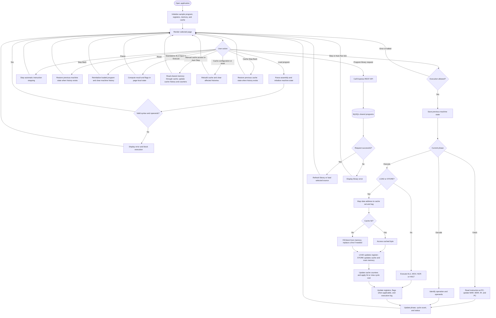
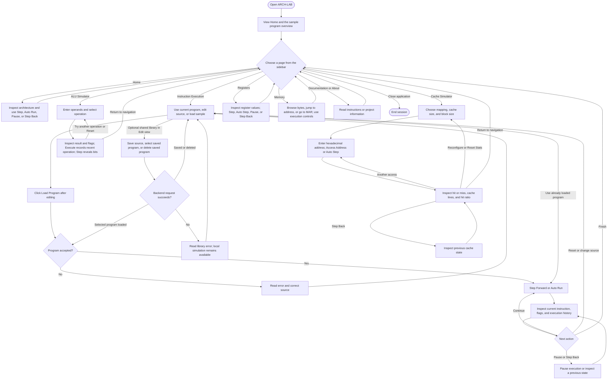

# ARCH-LAB Flowcharts

These diagrams describe the current application after removing the CPU Simulator and Performance Analysis pages. Simulation runs in the browser; the optional backend provides the shared program library. The shared CPU engine still powers instruction execution, registers, memory, and the Home overview.

## System flowchart

Each instruction step advances one phase. Fetching beyond the last instruction or executing HALT ends execution. Auto Run repeats steps until paused or completed. ALU Step reveals bits of the computed result; it does not advance the shared machine. Cache manual accesses share the machine's cache but do not execute instructions. Loading a saved program uses source already retrieved in the library list; it then follows the same parsing path as a locally entered program.

## User flowchart

There is no login. Programs saved through the backend belong to a shared public library. Home, Registers, Memory, and Instruction Execution view the same machine state; changing pages preserves it. The standalone ALU's inputs and recent operations are local to its page.
